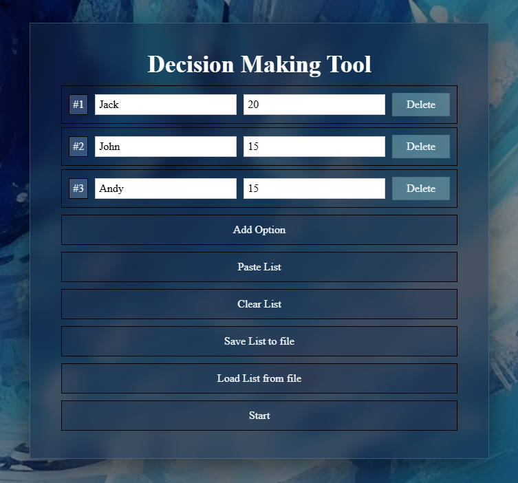
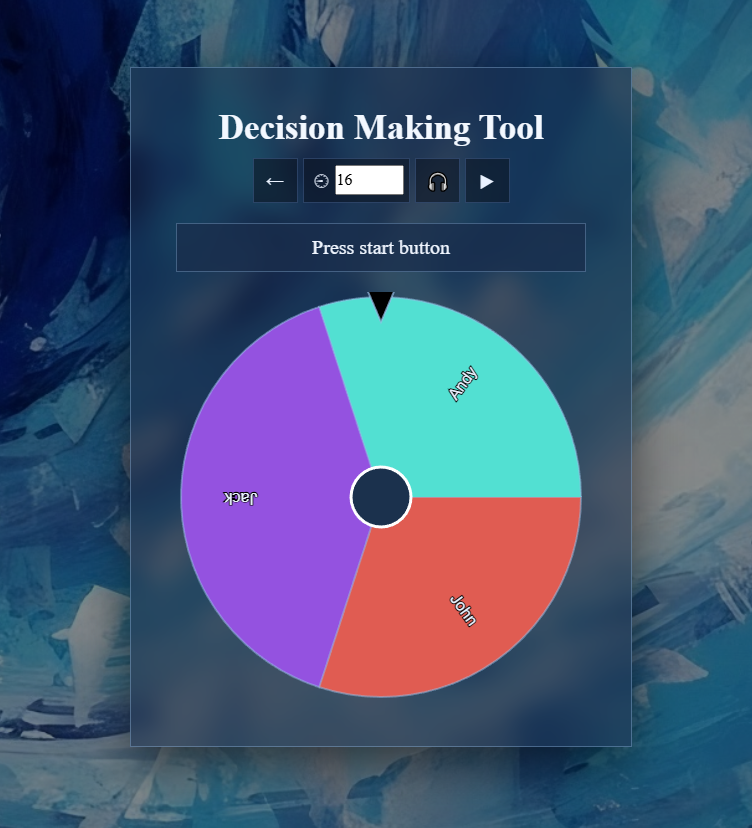

# Decision Making Tool

**Decision Making Tool** — a simple and elegant web application for making weighted decisions.
Create a list of options, assign weights, and let the animated picker wheel choose the final result for you.

## 🌐 Live Demo
* [Netlify](https://q-decision-making-tool.netlify.app/)

## 🖥️ Screenshot

## Features

1. Create and manage a list of options with custom weights  
2. Automatic ID generation for options  
3. Paste multiple options at once via modal window  
4. Validation before starting the picker  
5. Animated spinning wheel with easing  
6. Weighted random selection  
7. Adjustable spin duration  
8. Sound feedback with toggle  
9. Save and load option lists as JSON files  
10. Persistent state via localStorage  
11. Clean cold-themed UI design  
12. Fully client-side, no backend required 

## Tech Stack

* **TypeScript**
* **HTML5 Canvas**
* **CSS**
* **Vite**

## Run Locally
1. Clone the repo: git clone https://github.com/SquallerQ/decision-making-tool.git
2. Install dependencies: npm install
3. Start development server: npm run dev
4. Open the app in your browser